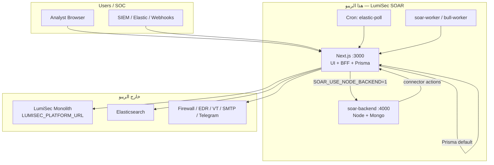

# LumiSec SOAR — Team Handoff (DevOps · Backend · Frontend)

> **الغرض:** تسليم جاهز للفرق الثلاثة لتعديل، نشر، وتشغيل المنصة في بيئات dev / staging / production.  
> **آخر تحديث:** يونيو 2026 · **الإصدار:** `0.2.0`  
> **حالة الكود:** بدون mocks وبدون demo seed — البيانات التشغيلية تأتي من SIEM / Elastic / webhooks / monolith فقط.

---

## 1. نظرة عامة

LumiSec SOAR منصة أتمتة أمنية (SOAR) مبنية على:

| الطبقة | التقنية | المسؤولية |
|--------|---------|-----------|
| **Web + BFF** | Next.js 15 (`:3000`) | UI، مصادقة، `/api/soar/*`، محرك workflows محلي |
| **SOAR data plane** (اختياري) | `mini-services/soar-backend` Node + Mongo (`:4000`) | incidents mirror، forensic audit، Shuffle API |
| **Platform monolith** (خارج هذا الريبو) | LumiSec backend | GRC · UCTC · Phishing · LumiNet — Outbound Actions |
| **Primary DB** | Prisma → SQLite (pilot) أو PostgreSQL (prod) | incidents، alerts، connectors، vault |
| **Forensic DB** | MongoDB (اختياري) | execution traces، connector calls، platform audit |



---

## 2. وضعا النشر

### Mode A — Pilot / فريق صغير (افتراضي)

```env
NEXT_PUBLIC_SOAR_GATEWAY=1
DATABASE_URL=file:./prisma/dev.db   # أو PostgreSQL في prod
# لا تحتاج Mongo ولا mini-backend
```

- كل `/api/soar/*` → `src/lib/soar-api/router.ts` + Prisma
- مناسب: dev محلي، POC، فريق ≤ 10 محللين

### Mode B — Production SOAR data plane (موصى به)

```env
NEXT_PUBLIC_SOAR_GATEWAY=1
SOAR_USE_NODE_BACKEND=1
SOAR_BACKEND_URL=http://backend:4000
SOAR_WORKFLOW_GATEWAY_URL=http://app:3000
SOAR_INTERNAL_API_KEY=<strong-secret>
MONGODB_URI=mongodb://...
DATABASE_URL=postgresql://...
```

- Next.js = BFF + workflows + auth
- `soar-backend` = Mongo incidents + proxy للـ gateway عند تنفيذ connectors

### Mode C — Monolith كـ API رئيسي (مستقبلي)

```env
NEXT_PUBLIC_SOAR_USE_REMOTE_GATEWAY=1
LUMISEC_API_URL=https://api.lumisec.example
LUMISEC_INTERNAL_API_KEY=...
```

- الـ UI يبقى في هذا الريبو؛ البيانات من monolith بعيد

---

## 3. DevOps — دليل النشر

### 3.1 المنافذ والخدمات

| الخدمة | Port | Health | ملاحظات |
|--------|------|--------|---------|
| `app` (Next.js) | 3000 | `GET /api/health` | UI + BFF |
| `backend` (Node) | 4000 | `GET /api/health` + Mongo ping | عند `SOAR_USE_NODE_BACKEND=1` |
| `postgres` | 5432 | `pg_isready` | prod Prisma |
| `redis` | 6379 | `redis-cli ping` | sessions / rate limit |
| `mongo` | 27017 | `mongosh ping` | forensic + node backend |
| `worker` | — | process alive | workflow executions |

### 3.2 Docker Compose (سريع)

```bash
cp deploy/.env.compose.example .env
# عدّل: ENCRYPTION_KEY, JWT_SECRET, SOAR_INTERNAL_API_KEY, LUMISEC_PLATFORM_URL

docker compose up -d postgres redis mongo backend app worker
```

ملف المرجع: [`deploy/.env.compose.example`](../deploy/.env.compose.example)  
Compose الرئيسي: [`docker-compose.yml`](../docker-compose.yml)

### 3.3 Kubernetes / Helm

| المسار | الوصف |
|--------|--------|
| [`deploy/k8s/`](../deploy/k8s/) | Manifests خام |
| [`deploy/helm/cybersoar/`](../deploy/helm/cybersoar/) | Helm chart |
| [`deploy/helm/cybersoar/values-production.yaml`](../deploy/helm/cybersoar/values-production.yaml) | Production overrides |

**Secrets إلزامية في prod (Helm `secrets.*`):**
`encryptionKey`, `jwtSecret`, `mongodbUri`, `redisUrl`, `webhookSecret`

### 3.4 CI/CD

Pipeline مرجعي: [`deploy/ci/ci-cd.yml`](../deploy/ci/ci-cd.yml)

```bash
npm ci --legacy-peer-deps
npm run verify          # typecheck + lint + test + build
npm run smoke           # بعد تشغيل الخدمات
npm run stack:verify    # فحص live stack + connectors
```

### 3.5 Cron — Elastic Security poll

Elastic **ليس** webhook افتراضياً — يحتاج poll دوري:

| الطريقة | الأمر / المسار |
|---------|----------------|
| Script (dev) | `npm run jobs:elastic-poll-loop` |
| One-shot | `npm run jobs:elastic-poll` |
| Internal API | `POST /api/internal/jobs/elastic-poll` + `Authorization: Bearer $SOAR_INTERNAL_API_KEY` |

**مثال Kubernetes CronJob:**

```yaml
apiVersion: batch/v1
kind: CronJob
metadata:
  name: soar-elastic-poll
spec:
  schedule: "*/5 * * * *"
  jobTemplate:
    spec:
      template:
        spec:
          restartPolicy: OnFailure
          containers:
            - name: poll
              image: curlimages/curl:8.5.0
              command:
                - sh
                - -c
                - |
                  curl -sf -X POST \
                    -H "Authorization: Bearer ${SOAR_INTERNAL_API_KEY}" \
                    -H "Content-Type: application/json" \
                    -d '{"minutes":10,"limit":100}' \
                    http://app:3000/api/internal/jobs/elastic-poll
              envFrom:
                - secretRef:
                    name: soar-secrets
```

### 3.6 Checklist أمني (إلزامي في production)

- [ ] `SOAR_DISABLE_DEV_AUTH=1` — لا login dev
- [ ] `ENCRYPTION_KEY` — 64 hex (`openssl rand -hex 32`)
- [ ] `JWT_SECRET` — عشوائي قوي ≥ 32 حرف
- [ ] `SOAR_INTERNAL_API_KEY` / `EXTERNAL_API_KEY` — ليس `dev-soar-key`
- [ ] HTTPS عبر reverse proxy (Nginx / Traefik / Ingress)
- [ ] MongoDB و PostgreSQL بـ auth + شبكة خاصة
- [ ] `CORS_ORIGIN` = domain الإنتاج فقط
- [ ] لا تُرفع `.env` إلى git

### 3.7 أوامر تشغيل مفيدة

```bash
npm run dev              # Next.js محلي (:3000)
npm run dev:core         # web + backend + worker
npm run backend:dev      # mini-backend فقط
npm run db:push          # Prisma schema → DB
npm run db:purge         # مسح بيانات تشغيل (لا users/workflows)
npm run smoke
npm run stack:verify
```

---

## 4. Backend — مسؤوليات الفريق

### 4.1 ما يُنفَّذ **داخل هذا الريبو** (جاهز)

| المجال | المسارات / الملفات |
|--------|-------------------|
| SOAR Gateway API | `GET/POST /api/soar/*` — [`docs/API.md`](API.md) |
| Incident respond | `POST /api/soar/incidents/:id/respond` |
| SIEM ingest | `POST /api/soar/integrations/siem/event` |
| Elastic | `POST /api/soar/integrations/elastic/event` · `elastic/poll` |
| Reverse ingest | `POST /api/soar/integrations/modules/incident` |
| Outbound (proxy) | `POST /api/soar/integrations/grc/*` · `uctc/*` · `phishing/campaign` |
| Platform probe | `GET /api/soar/platform/status` |
| Webhooks | `POST /api/webhook/{slug}` |
| Workflow engine | `src/lib/soar/execution/engine.ts` |
| Connectors | ~22 executor حقيقي (HTTP/SMTP) — [`src/lib/integrations/catalog.ts`](../src/lib/integrations/catalog.ts) |

**كود التكامل مع monolith:** [`src/lib/lumisec-api/platform-outbound.ts`](../src/lib/lumisec-api/platform-outbound.ts)

### 4.2 ما يجب على **فريق LumiSec Monolith** توفيره

وثيقة العقد الكاملة: [`docs/LUMISEC-PLATFORM-INTEGRATION-BRIEF.md`](LUMISEC-PLATFORM-INTEGRATION-BRIEF.md)

**متغيرات البيئة (monolith):**

```env
LUMISEC_PLATFORM_URL=https://api.lumisec.example    # في SOAR .env
LUMISEC_INTERNAL_API_KEY=<service-key>              # نفس المفتاح على الطرفين
```

> **تحذير:** `LUMISEC_PLATFORM_URL` ≠ `SOAR_BACKEND_URL`  
> الأول = monolith كامل (GRC/UCTC/Phishing)  
> الثاني = `mini-services/soar-backend` فقط

**Endpoints المطلوبة على monolith:**

| SOAR يستدعي | الغرض |
|-------------|--------|
| `POST /api/soar/integrations/grc/finding` | رفع finding من incident |
| `POST /api/soar/integrations/grc/risk` | risk register |
| `POST /api/soar/integrations/uctc/rule` | نشر rule |
| `POST /api/soar/integrations/uctc/rule-trigger` | تشغيل rule |
| `POST /api/soar/integrations/phishing/campaign` | حملة تصيد |
| `GET /api/health` + dashboards | platform status probe |
| Reverse: `POST /api/{grc,uctc,phishing,luminet}/integrations/soar/incident` | modules → SOAR |

حتى يُضبط `LUMISEC_PLATFORM_URL`، Outbound Actions ترجع **501/502 حقيقية** (لا fake success).

### 4.3 mini-services/soar-backend

| ملف | دور |
|-----|-----|
| [`mini-services/soar-backend/README.md`](../mini-services/soar-backend/README.md) | تشغيل محلي |
| [`mini-services/soar-backend/.env.example`](../mini-services/soar-backend/.env.example) | env للـ Node backend |
| `src/routes/soar/index.js` | REST mirror + proxy لـ Next gateway |
| `src/lib/gateway-proxy.js` | تنفيذ connectors عبر Prisma gateway |

**عند الدمج مع BFF:**

```env
# root .env
SOAR_USE_NODE_BACKEND=1
SOAR_BACKEND_URL=http://localhost:4000
SOAR_INTERNAL_API_KEY=...
SOAR_WORKFLOW_GATEWAY_URL=http://localhost:3000

# mini-services/soar-backend/.env
PORT=4000
MONGODB_URI=mongodb://...
EXTERNAL_API_KEY=<نفس SOAR_INTERNAL_API_KEY>
SOAR_WORKFLOW_GATEWAY_URL=http://localhost:3000
```

### 4.4 Priority SOC stack (ترتيب الربط)

| # | Connector | Config keys | إجراء SOAR |
|---|-----------|-------------|------------|
| 1 | **Elasticsearch** | `url`, `api_key`, `alerts_index` | Poll + ingest alerts |
| 2 | **Firewall** | FortiGate / OPNsense / pfSense | `block_ip` |
| 3 | **VirusTotal** | `api_key` | `enrich_ip`, `scan_hash` |
| 4 | **Email SMTP** | host, user, pass, `default_to` | `notify_email` |
| 5 | **Telegram** | `bot_token`, `phone_contacts` JSON | `notify_telegram` |

Telegram: لا يرسل برقم هاتف مباشرة — يحتاج `chat_id` في `phone_contacts` بعد أن يكتب المستخدم للبوت.

### 4.5 مواصفات API إضافية (للمرجع)

| الوثيقة | الجمهور |
|---------|---------|
| [`docs/API.md`](API.md) | كل مسارات Gateway + Legacy |
| [`docs/soar/reference/BACKEND-IMPLEMENTATION-SPEC.md`](soar/reference/BACKEND-IMPLEMENTATION-SPEC.md) | endpoints ناقصة على monolith (مستقبلي) |
| [`docs/soar/ARCHITECTURE.md`](soar/ARCHITECTURE.md) | معمارية داخلية |

---

## 5. Frontend — مسؤوليات الفريق

### 5.1 المبدأ

الـ UI **عميل رفيع** — لا Prisma ولا executors في المكونات:

```
React (SoarApp) → soarFetch('/api/soar/...') → Next BFF → Prisma / Node backend
```

### 5.2 متغيرات البناء (build-time)

| المتغير | القيمة | التأثير |
|---------|--------|---------|
| `NEXT_PUBLIC_SOAR_GATEWAY` | `1` (افتراضي) | UI صناعة SOAR (Incidents sidebar) |
| `NEXT_PUBLIC_SOAR_GATEWAY` | `0` | Legacy Cases UI |
| `NEXT_PUBLIC_SOAR_USE_REMOTE_GATEWAY` | `1` | proxy لـ monolith بعيد |
| `NEXT_PUBLIC_LUMISEC_API_URL` | URL | base للـ remote gateway |
| `NEXT_PUBLIC_EXTERNAL_API_URL` | `http://backend:4000` | assets / legacy mirror |

### 5.3 هيكل الواجهة

| المسار في الكود | الوصف |
|-----------------|--------|
| `src/components/soar/SoarApp.tsx` | Shell + sidebar |
| `src/lib/soar/sidebar-nav.ts` | ترتيب التنقل (Operations → Automation → Integrations → Evidence) |
| `src/components/gateway/*` | شاشات Incidents, Connectors, Vault, … |
| `src/lib/lumisec-api/browser/*` | HTTP clients للـ BFF |
| `src/lib/soar/mode.ts` | `SoarNavigate` — تنقل SPA داخلي (ليس Next routes) |

### 5.4 بناء ونشر Frontend

```bash
npm ci --legacy-peer-deps
npm run db:generate
npm run build          # next build + standalone
npm run start          # production standalone
```

**Dev (Windows):** استخدم `npm run dev` مع `--webpack` (موجود في script) — Turbopack يكسر dynamic routes على Windows.

**Login (dev فقط — `SOAR_DISABLE_DEV_AUTH=0`):**

- Email: `admin@soar.local`
- Password: `admin123`

في production: OIDC env vars (`OIDC_ISSUER`, `OIDC_CLIENT_ID`, `OIDC_CLIENT_SECRET`) — راجع `extractAuthContext`.

### 5.5 سلوك UI المتوقع بدون بيانات

- Dashboard / Alerts فارغة حتى ingest حقيقي — banner: `SoarEmptyPlatformBanner`
- Outbound Actions: رسالة إعداد عند 501
- Connectors: Priority stack card + زر Poll Elastic

---

## 6. جدول متغيرات البيئة (مرجع كامل)

| المتغير | مطلوب | الفريق | الوصف |
|---------|--------|--------|--------|
| `ENCRYPTION_KEY` | ✅ prod | DevOps | 64 hex — تشفير credentials |
| `JWT_SECRET` | ✅ prod | DevOps | JWT / sessions |
| `DATABASE_URL` | ✅ | DevOps | SQLite (pilot) أو PostgreSQL |
| `SOAR_DISABLE_DEV_AUTH` | ✅ prod=`1` | DevOps | تعطيل login dev |
| `NEXT_PUBLIC_SOAR_GATEWAY` | ✅ | Frontend | `1` = SOAR UI |
| `MONGODB_URI` | اختياري | DevOps | forensic + node backend |
| `MONGODB_DB` | اختياري | DevOps | default `soar` |
| `SOAR_USE_NODE_BACKEND` | prod موصى | DevOps | `1` = Mongo data plane |
| `SOAR_BACKEND_URL` | مع node BE | DevOps | URL mini-backend |
| `SOAR_WORKFLOW_GATEWAY_URL` | مع node BE | Backend | URL Next للـ proxy |
| `SOAR_INTERNAL_API_KEY` | ✅ prod | DevOps | مفتاح خدمة BFF ↔ backend |
| `LUMISEC_PLATFORM_URL` | للـ outbound | Backend | monolith URL |
| `LUMISEC_INTERNAL_API_KEY` | للـ outbound | Backend | مفتاح monolith |
| `EXTERNAL_API_KEY` | legacy | DevOps | = `SOAR_INTERNAL_API_KEY` غالباً |
| `NEXT_PUBLIC_EXTERNAL_API_URL` | اختياري | Frontend | mini-backend public |
| `REDIS_URL` | prod | DevOps | sessions / rate limit |
| `ELASTIC_POLL_MINUTES` | اختياري | DevOps | نافذة poll (default 5) |
| `ELASTIC_POLL_INTERVAL_MS` | اختياري | DevOps | loop interval |
| `WORKER_API_KEY` | workers | DevOps | internal jobs |
| `OIDC_*` | SSO | DevOps/Backend | production auth |

نسخ للتطوير: [`.env.example`](../.env.example)  
نسخ لـ Docker: [`deploy/.env.compose.example`](../deploy/.env.compose.example)

---

## 7. خطوات النشر (Staging مثال)

### DevOps

1. Provision: PostgreSQL, Redis, MongoDB (أو docker compose)
2. نسخ `.env` من `.env.example` / `deploy/.env.compose.example`
3. توليد secrets (`ENCRYPTION_KEY`, `JWT_SECRET`, `SOAR_INTERNAL_API_KEY`)
4. `docker compose up -d` أو Helm deploy
5. `npm run db:push` أو `prisma migrate deploy` على app container
6. إعداد CronJob لـ elastic-poll
7. Ingress + TLS + `SOAR_DISABLE_DEV_AUTH=1`

### Backend

1. نشر monolith + ضبط `LUMISEC_PLATFORM_URL` في SOAR
2. تنفيذ endpoints §4.2 + إعطاء `LUMISEC_INTERNAL_API_KEY` لـ DevOps
3. اختبار: `GET /api/soar/platform/status` → كل modules green
4. Smoke outbound: GRC finding من incident

### Frontend

1. Build مع `NEXT_PUBLIC_SOAR_GATEWAY=1`
2. التحقق من CORS و cookie domain على Ingress
3. اختبار يدوي: login → Connectors → Test Elastic → Poll

---

## 8. التحقق بعد النشر

```bash
# 1. Health
curl -s http://localhost:3000/api/health
curl -s -H "X-API-Key: $SOAR_INTERNAL_API_KEY" http://localhost:4000/api/health

# 2. SOAR API smoke
npm run smoke -- --base https://soar.example.com

# 3. Live stack (connectors + DB counts)
npm run stack:verify

# 4. Platform (يتطلب LUMISEC_PLATFORM_URL)
curl -s -b "soar_session=..." https://soar.example.com/api/soar/platform/status

# 5. Elastic poll (يتطلب connector متصل)
curl -X POST -H "Authorization: Bearer $SOAR_INTERNAL_API_KEY" \
  -H "Content-Type: application/json" \
  -d '{"minutes":60,"limit":50}' \
  https://soar.example.com/api/internal/jobs/elastic-poll
```

**اختبارات CI:** `157` test — `npm test` يجب أن يمر قبل merge.

---

## 9. فهرس الوثائق

| الوثيقة | لمن |
|---------|-----|
| **هذا الملف** | الجميع — نقطة البداية |
| [`docs/DEPLOYMENT.md`](DEPLOYMENT.md) | DevOps — تفاصيل infra |
| [`docs/API.md`](API.md) | Backend + Frontend — عقد API |
| [`docs/LUMISEC-PLATFORM-INTEGRATION-BRIEF.md`](LUMISEC-PLATFORM-INTEGRATION-BRIEF.md) | Backend monolith |
| [`docs/soar/ARCHITECTURE.md`](soar/ARCHITECTURE.md) | Architects |
| [`docs/soar/CONNECTOR-SDK.md`](soar/CONNECTOR-SDK.md) | Backend — connectors جديدة |
| [`deploy/ci/ci-cd.yml`](../deploy/ci/ci-cd.yml) | DevOps — pipeline |

---

## 10. جهات اتصال / قرارات مفتوحة

| القرار | الخيارات | التوصية |
|--------|----------|---------|
| Primary DB | SQLite vs PostgreSQL | PostgreSQL في staging/prod |
| SOAR data | Prisma only vs Node+Mongo | Node+Mongo في prod |
| Auth | Dev login vs OIDC | OIDC في prod |
| Elastic ingest | Poll vs webhook | Poll (CronJob) + webhook اختياري |
| Monolith URL | dev/staging/prod | متغير منفصل لكل بيئة |

---

*Generated for LumiSec SOAR team handoff — يونيو 2026*
