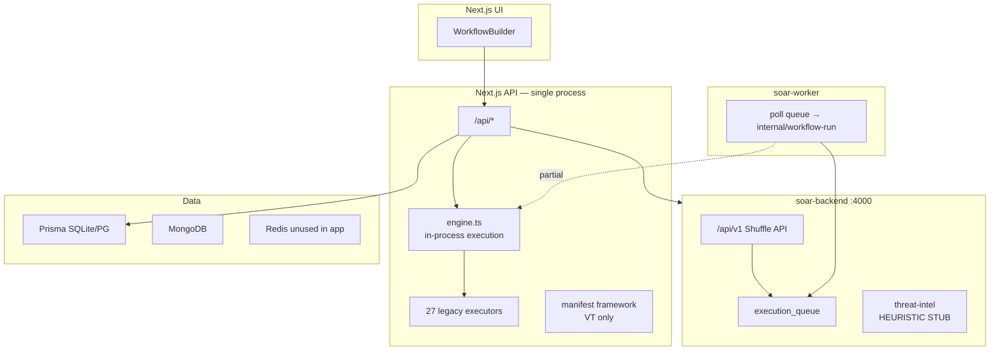
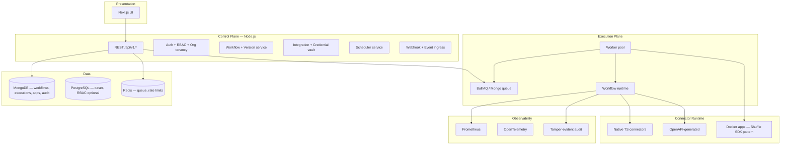

# RFC-001: Enterprise SOAR Platform Transformation

| Field | Value |
|-------|-------|
| **Status** | **APPROVED — Waves 2–3 complete** |
| **Author** | Platform Engineering |
| **Date** | 2026-06-27 |
| **Stakeholders** | Security Engineering, Platform, SRE, Product |

---

## 1. Executive Summary

LumiSec SOAR is a **functional automation MVP** with a real graph executor, ~22 HTTP integrations, RBAC, encryption, and deployment scaffolding. It is **not yet** a commercial-grade SOAR comparable to Sentinel Automation, Splunk SOAR, XSOAR, or Shuffle at scale.

This RFC proposes a **phased enterprise transformation** centered on one principle you correctly identified:

> Build a **production-grade Connector / Plugin SDK** first, then ship integrations **one vendor at a time** with official API docs, test credentials, and certification — not 80 connectors in one prompt.

**References (open source + official):**

| Source | What we adopt |
|--------|----------------|
| [Shuffle](https://github.com/Shuffle/Shuffle) + [shuffle-docs API](https://github.com/shuffle/shuffle-docs/blob/master/docs/API.md) | Workflow document model, queue/worker, webhooks, OpenAPI apps, `$exec` templating |
| [Shuffle python-apps](https://github.com/shuffle/python-apps) | Docker-based app execution pattern |
| [Splunk SOAR SDK](https://phantomcyber.github.io/splunk-soar-sdk/) | Action decorators, typed params/outputs, `test_connectivity`, asset credentials |
| [Cortex Analyzers](https://thehive-project.github.io/Cortex-Analyzers/dev_guides/how-to-create-an-analyzer/) | Observable-in / taxonomy-out, `requirements.txt`, report templates |
| Your `TECHNICAL_DOCUMENTATION_AR.md` (Shuffle) | Full API catalog §7, §21 — ported to Node + MongoDB per `docs/AI_AGENT_BRIEFING.md` |

---

## 2. Current State (Repository Audit)

### 2.1 What is REAL today

| Component | Evidence | Production grade? |
|-----------|----------|-------------------|
| Workflow graph engine | `src/lib/executors/engine.ts` — BFS, branches, retry, timeout | Partial — runs **in API process** |
| 22 vendor nodes | `src/lib/executors/nodes/*.ts` — real `fetch`/SMTP/GraphQL | Yes **when credentials configured** |
| Webhook ingress | `src/app/api/webhook/[path]/route.ts` | Yes |
| RBAC + API keys | `src/lib/auth.ts` | Partial — dev auth bypass; no OIDC/MFA |
| Secret encryption | AES-256-GCM `src/lib/crypto.ts` | Yes |
| SSRF (HTTP nodes) | `src/lib/soar/security/ssrf-guard.ts` | Yes for `http`/`webhook`; **not** FortiGate/OPNsense |
| Audit hash chain | `src/lib/audit.ts` | Yes (Prisma path) |
| Prometheus | `/api/metrics` | Yes |
| Shuffle-compatible API (started) | `mini-services/soar-backend` `/api/v1/*` | Partial — queue exists; worker wiring incomplete |
| Node manifest framework | `src/lib/soar/nodes/manifest.ts` | **1/27 nodes** (VirusTotal only) |

### 2.2 What is FAKE / STUB / BROKEN (must fix)

| # | Issue | Path | Policy violation |
|---|-------|------|------------------|
| P0-1 | **`POST /api/integrations/test` missing** — UI calls it | UI: `page.tsx`; no route | Broken production API |
| P0-2 | **Email without SMTP returns `success: true` + queued** | `email.ts` | Zero Mock Policy |
| P0-3 | **Isolate host always stub (queued)** | `builtin.ts` | Zero Mock Policy |
| P0-4 | **Block IP stub when no firewall** | `builtin.ts` | Zero Mock Policy |
| P0-5 | **Threat intel backend = hardcoded good/bad lists** | `threat-intel.js` | Zero Mock Policy |
| P0-6 | **`finishExecution()` no-op** | `shuffle-backend.ts` | Incomplete integration |
| P0-7 | **Schedule trigger = UI only, no cron service** | `WorkflowBuilder` | Fake trigger |
| P0-8 | **Approval API exists but engine ignores gates** | `engine.ts` vs `/api/approvals` | Enterprise gap |
| P1-1 | Rate limiter in-memory despite Redis in compose | `rate-limit.ts` | HA gap |
| P1-2 | Dual storage story: docs say Mongo primary; Prisma SQLite default | `schema.prisma` | Architecture drift |
| P1-3 | 26/27 nodes on legacy path, not manifest | `bootstrap.ts` | SDK gap |

### 2.3 Architecture today

---

## 3. Target Architecture (Approved Direction)

Align with `docs/AI_AGENT_BRIEFING.md`: **Node.js + MongoDB** control plane, **durable queue**, **separate workers**, **no Go/OpenSearch as primary**.

### 3.1 Design principles

1. **Connector SDK is the product** — vendors are plugins, not hardcoded `switch(type)` forever.
2. **Fail closed** — no `success: true` on stub/queued actions unless explicitly configured as dry-run.
3. **Durable execution** — API enqueues; workers execute; API never blocks on 30-node playbooks.
4. **Shuffle compatibility layer** — import workflows/apps from Shuffle ecosystem where license permits (MIT apps, AGPL backend patterns as reference only).
5. **One connector = one RFC** — Sentinel, Splunk, CrowdStrike each get vendor RFC + test env + certification checklist.

---

## 4. Connector SDK Specification (Core Deliverable)

### 4.1 Contract: `NodeManifest` + `NodeExecutor` (already started)

Extend existing `src/lib/soar/nodes/manifest.ts` to become the **only** registration path.

Every connector MUST implement:

| Capability | Manifest field | Runtime enforcement |
|------------|----------------|---------------------|
| Typed inputs/outputs | Zod schemas | Pre/post execution validation |
| Credentials | `credentials[]` | Loaded from Integration vault |
| Retry / timeout / CB / rate limit | policies | Engine middleware |
| `testConnectivity()` | `healthCheck` action | `POST /api/integrations/test` |
| OpenAPI export | `/api/nodes/{id}/openapi` | Marketplace + docs |
| Audit + metrics | hooks in executor | Mandatory wrapper |
| Idempotency | `supportsIdempotency` | Mongo TTL cache |
| SSRF allowlist | `allowedHosts[]` | `safeFetch` only |
| Versioning | `version` + `migrations` | Registry |

**Splunk SOAR SDK pattern adopted:** `@app.action(name=..., params_class=..., output_class=...)` maps to our `NodeExecutor.execute` + Zod.

**Cortex pattern adopted:** observable taxonomy in `output.summary` for case/alert UI.

**Shuffle pattern adopted:** `app.yaml` + Docker image for Python actions not worth porting to TS.

### 4.2 Three connector tiers

| Tier | When to use | Example |
|------|-------------|---------|
| **T1 Native** | High-volume, security-critical, needs SSRF/CB | VirusTotal, HTTP, FortiGate |
| **T2 OpenAPI** | Vendor publishes OpenAPI 3 | Generated from [shuffle/security-openapis](https://github.com/shuffle/security-openapis) |
| **T3 Container** | Python-only SDK (Shuffle app_sdk) | Legacy Shuffle python-apps |

### 4.3 Connector certification checklist (per vendor)

- [ ] Official API documentation URL cited in manifest
- [ ] Sandbox/test tenant credentials in CI secrets
- [ ] `testConnectivity` hits real endpoint (not string match)
- [ ] Integration test with recorded fixtures (VCR) + live smoke (nightly)
- [ ] SSRF tests for any URL parameter
- [ ] Rate limit matches vendor tier
- [ ] Error catalog maps vendor codes → platform codes
- [ ] Security review sign-off

### 4.4 Realistic connector roadmap (not all at once)

**Wave 1 ✅ (certified manifests — `wave1-certified.ts`):** VirusTotal, AbuseIPDB, IPInfo, OTX, HTTP, Slack, Email, Jira, ServiceNow, Splunk, Elastic, Wazuh, MISP, OpenCTI, FortiGate, OPNsense, MS Graph, TheHive, PagerDuty, DefectDojo, DigitalOcean, Velociraptor, plus builtins (condition, trigger, log, block, isolate, create_case, create_alert, soar_utils, webhook).

**Wave 2 ✅:** Microsoft Sentinel, CrowdStrike Falcon, GreyNoise, Shodan, Teams webhook, ServiceNow CMDB.

**Wave 3 ✅:** Entra ID, AWS Security Hub, GCP SCC.

**OSS extended ✅ (community priority):** pfSense, Cuckoo Sandbox, ClamAV, Arkime — see `docs/soar/connectors/OSS-CATALOG.md` and `CONNECTOR-SDK.md`.

---

## 5. Workflow Engine Enhancements

| Feature | Shuffle ref | Our approach |
|---------|-------------|--------------|
| Parameter templating | `$exec`, `$action.field` | `src/lib/shuffle/parameter-resolver.ts` + `{{trigger}}` |
| Execution snapshot | `PrepareWorkflowExecution` | Mongo `workflow_executions.workflow` copy |
| Queue + worker | Orborus + Worker | `soar-backend` queue + `soar-worker` |
| Webhooks | `POST /hooks/:id` | Implemented in shuffle-v1 |
| Schedules | gocron in Go backend | **New:** `scheduler` service + Bull repeatable jobs |
| Sub-workflows | Shuffle subflow trigger | Phase 2 — call graph with depth limit |
| Approvals | XSOAR manual task | Wire `awaiting_approval` in engine |
| Parallel branches | Worker topological | Engine: fan-out with concurrency limit |
| Versioning | Workflow history | Mongo `workflows` + `version` field + diff API |

---

## 6. Zero Mock Policy — Remediation Plan

| Item | Action | Phase |
|------|--------|-------|
| integrations/test | Restore route; delegate to per-type `testConnectivity` | **P0 — no RFC needed** |
| email queued success | Return `success: false` or `dry_run: true` explicitly | P0 |
| isolate/block stubs | Remove nodes from palette OR implement real EDR/firewall OR fail closed | P0 |
| threat-intel.js | Call VT/OTX/GreyNoise via existing integrations | P1 |
| finishExecution | Wire to `POST /api/v1/streams/finish` | P0 |
| seed demo data | Keep behind `SOAR_DEMO_MODE=1` only | P1 |
| schedule | Implement `scheduler` microservice | P1 |

---

## 7. Security Impact

| Change | Risk | Mitigation |
|--------|------|------------|
| Worker internal API | Token theft → arbitrary execution | `WORKER_API_KEY`, mTLS in prod, NetworkPolicy |
| Docker app tier | Container escape | gVisor/Firecracker option, read-only rootfs, no socket in app containers |
| Mongo as primary | Data residency | Encryption at rest, tenant `org_id` on all queries |
| OpenAPI codegen | SSRF via generated URLs | Mandatory allowlist in manifest |
| Removing fake success | UX breaking | Clear error messages + integration setup wizard |

---

## 8. Migration Plan

### Phase 0 — Stabilize (1–2 weeks, **request approval to start**)

- [ ] Restore `/api/integrations/test`
- [ ] Fail-closed stubs (email, block, isolate)
- [ ] Wire worker end-to-end (queue → worker → engine → finish)
- [ ] Fix `finishExecution` backend call
- [ ] Document env matrix (SQLite dev vs PG/Mongo prod)

### Phase 1 — Connector SDK GA (3–4 weeks)

- [ ] Migrate all 27 legacy executors → manifest registry
- [ ] Engine uses registry only (delete legacy dispatch table)
- [ ] `docs/soar/CONNECTOR-SDK.md` + CLI `npm run connector:validate`
- [ ] OpenAPI importer from Shuffle security-openapis (pilot: 5 apps)

### Phase 2 — Durable execution (2–3 weeks)

- [x] BullMQ on Redis (replace in-process fire-and-forget)
- [x] Scheduler service for cron (node-cron in soar-backend; Bull repeatable optional)
- [x] Approval gates in engine
- [x] Alert → workflow event bus (Redis pub/sub + event processor)

### Phase 3 — Enterprise connectors (ongoing, 1 vendor/sprint)

- [x] Microsoft Sentinel — incidents + KQL
- [x] CrowdStrike Falcon — hosts, detections, contain/lift
- [x] GreyNoise — community/context/RIOT
- [x] Shodan — host lookup + search
- [x] Microsoft Teams — incoming webhook
- [x] ServiceNow CMDB — query/get/create CI
- [x] Entra ID — identity via Microsoft Graph
- [x] AWS Security Hub — findings + standards
- [x] GCP Security Command Center — list/get/update findings
- [ ] Certification pipeline in CI
- [ ] Marketplace UI (signed packages)

### Phase 4 — MSSP / multi-tenant (4+ weeks)

- [ ] Org hierarchy (Shuffle `org_id` model)
- [ ] Per-tenant credential isolation audit
- [ ] Billing metering hooks

---

## 9. Rollback Plan

| Phase | Rollback |
|-------|----------|
| P0 test route | Delete route; UI shows "test unavailable" |
| Fail-closed stubs | Feature flag `SOAR_ALLOW_DRY_RUN=1` |
| BullMQ worker | `EXECUTION_MODE=inline` env reverts to in-process |
| Manifest migration | Registry keeps legacy aliases; dual-register during transition |

---

## 10. Testing Strategy

| Layer | Tool | Target |
|-------|------|--------|
| Unit | Vitest | SDK, templating, adapters |
| Integration | Vitest + testcontainers | Mongo, Redis, engine |
| Connector live | Nightly CI with secrets | 1 smoke call per connected vendor |
| Security | Existing SSRF/sanitizer suite | 100% outbound paths |
| Load | k6 | 100 RPS enqueue, worker scale |
| Chaos | Litmus / toxiproxy | Worker kill mid-execution |
| E2E | Playwright | Login → integration test → run workflow |

---

## 11. Acceptance Criteria (Phase 0 complete)

1. `POST /api/integrations/test` returns real VT/IPInfo result with valid key.
2. Email without SMTP returns **failure**, not success.
3. Worker consumes queue item and execution ends `FINISHED` or `FAILED` in Mongo.
4. No production code path returns simulated success without `dry_run` flag.
5. `npm test` ≥ 100 tests passing; security suite green.

---

## 12. Acceptance Criteria (Platform GA — future)

1. All connectors via manifest registry with `testConnectivity`.
2. Executions durable across API pod restart.
3. Cron schedules fire real workflows.
4. ≥5 Wave-2 connectors certified with official API docs linked.
5. SOC2 evidence: audit chain verification, penetration test report.

---

## 13. What we explicitly will NOT do

- Claim 80+ vendor integrations without certification.
- Copy Shuffle AGPL Go backend verbatim.
- Ship `success: true` for actions that did not call a real API.
- Merge all databases into Mongo overnight without migration RFC.

---

## 14. Approval Requested

Please approve **Phase 0** to proceed:

1. Restore integration test API  
2. Fail-closed remediation for stubs  
3. Complete worker ↔ queue ↔ engine pipeline  
4. Begin manifest migration (Wave 1 connectors, starting with HTTP + Slack + Jira)

**Phase 1+ requires separate approval** after Phase 0 demo in staging.

---

## 15. References

- Shuffle GitHub: https://github.com/Shuffle/Shuffle  
- Shuffle API docs: https://github.com/shuffle/shuffle-docs/blob/master/docs/API.md  
- Shuffle python-apps: https://github.com/shuffle/python-apps  
- Splunk SOAR SDK: https://phantomcyber.github.io/splunk-soar-sdk/  
- Cortex analyzer guide: https://thehive-project.github.io/Cortex-Analyzers/dev_guides/how-to-create-an-analyzer/  
- Internal: `docs/AI_AGENT_BRIEFING.md`, `docs/soar/ARCHITECTURE.md`, `docs/soar/NODE-AUTHORING.md`
