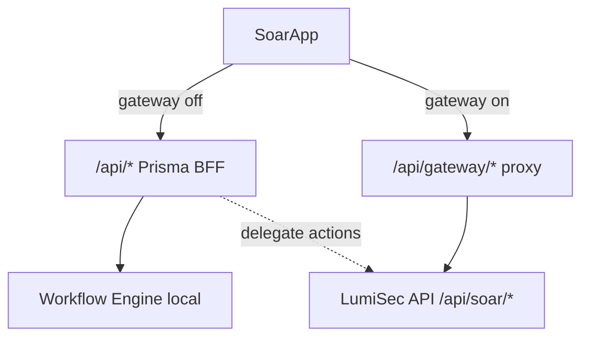

# SOAR2 Merge Plan — دمج `soar2` مع المشروع الرئيسي

> **المرجع:** `soar2/my-project (1)/` — واجهة مربوطة بـ `/api/soar/*` على `lumisec.tech`  
> **الهدف:** منصة SOAR واحدة بمنطق صناعي صحيح (Splunk SOAR / Cortex XSOAR / IBM QRadar SOAR)

---

## 1. منطق SOAR الصناعي (مصدر الحقيقة)

| كيان | المالك بعد الدمج | ملاحظة |
|------|------------------|--------|
| **Incidents** | Gateway `/api/soar/incidents` | ليس "Cases" — الحادث يجمع alerts + artifacts + timeline |
| **Alerts** | Gateway `/api/soar/alerts` | تُرفع إلى incident أو تُغلق كـ false positive |
| **Playbooks** | Gateway `/api/soar/playbooks` + runs | أتمتة الاستجابة على incident |
| **Connectors** | Gateway `/api/soar/connectors` | مصادر البيانات الواردة (SIEM, EDR, email) |
| **Vault** | Gateway `/api/soar/vault` | أسرار الـ connectors (لا credentials في UI) |
| **Integrations (outbound)** | Gateway `/api/soar/integrations/*` | block-ip, isolate-host, threat-intel |
| **Artifacts / IOCs** | Gateway `/api/soar/artifacts` | مرتبطة بالـ incident + enrich |
| **Webhooks** | Gateway `/api/soar/webhook-sources` | ingestion triggers |
| **Workflows (visual)** | **محلي مؤقت** | حتى يدعم الباك اند visual graph API |
| **Workflow engine** | **محلي** (`lib/executors`) | ينفّذ nodes؛ يُستدعى من playbooks أو BFF |

---

## 2. ما تم دمجه (المرحلة 1 — الحالية)

```
src/lib/lumisec-api/
├── config.ts              ← isGatewayMode(), env
├── client.ts              ← server-side (موجود، محدّث)
└── browser/
    ├── api-client.ts      ← BFF proxy client (/api/gateway/*)
    ├── soarIncidents.ts   ← من soar2
    ├── soarAlerts.ts
    ├── soarPlaybooks.ts
    ├── soarConnectors.ts
    ├── soarVault.ts
    ├── soarArtifacts.ts
    ├── soarDashboard.ts
    ├── soarAnalytics.ts
    └── … (UI helpers + demo fallbacks)

src/app/api/gateway/[...path]/route.ts   ← BFF → LUMISEC_API_URL

src/components/gateway/                  ← UI من soar2
├── IncidentsList.tsx
├── IncidentDetailPage.tsx
├── ConnectorsManagement.tsx
├── VaultManagement.tsx
└── …

src/hooks/use-gateway-mode.ts            ← تفعيل وضع Gateway
```

**SoarApp** يبدّل تلقائياً عند `LUMISEC_API_URL` + `LUMISEC_INTERNAL_API_KEY` (أو `NEXT_PUBLIC_SOAR_GATEWAY=1`):
- **Gateway ON:** Incidents, Connectors, Vault, Artifacts, Webhooks, live Dashboard/Analytics
- **Gateway OFF:** Cases, Prisma BFF, workflow engine المحلي (الوضع الحالي)

---

## 3. معمارية الدمج



**لماذا BFF proxy وليس اتصال مباشر من المتصفح؟**
- لا نكشف `X-Internal-Api-Key` في الـ frontend
- نفس origin → لا CORS
- جلسة cookie المحلية تُحوّل لـ headers للباك اند
- نمط Splunk/XSOAR enterprise: UI → API gateway → services

---

## 4. ما لم يُدمج بعد (المرحلة 2–3)

| من soar2 | الإجراء |
|----------|---------|
| Multi-route `/incidents/[id]` | اختياري — SoarApp يستخدم state pages |
| JWT localStorage login | نستخدم cookie session + BFF (أأمن) |
| `SOARApp.tsx` من soar2 | دُمج في `SoarApp.tsx` بدل نسخة منفصلة |
| Playbook runs standalone pages | إضافة `/playbook-runs` لاحقاً |
| إزالة Prisma BFF | بعد اكتمال 79 endpoint في الباك اند |
| `recommended-actions` | دمج soar2 incident detail + منطق `lib/incidents/*` |

---

## 5. تفعيل Gateway mode

```env
NEXT_PUBLIC_SOAR_GATEWAY=1
LUMISEC_API_URL=https://lumisec.tech
LUMISEC_INTERNAL_API_KEY=your-service-key
```

ثم `npm run dev` — القائمة الجانبية تعرض Incidents / Connectors / Vault.

---

## 6. قرارات الدمج الحرجة

1. **Incidents ≠ Cases** — في gateway mode نخفي Cases ونستخدم Incidents من Mongo `_id`.
2. **Threat Ops** يبقى للـ queue الموحّد؛ Investigate يفتح gateway incident detail عند تفعيل gateway.
3. **Workflows** تبقى محلية حتى الباك اند يوفّر visual workflow API.
4. **لا تحذف `soar2/`** حتى نتأكد من parity كامل — ثم archive.

---

## 7. مراجع

- [`SOAR_API_Reference.md`](reference/SOAR_API_Reference.md)
- [`BACKEND-IMPLEMENTATION-SPEC.md`](reference/BACKEND-IMPLEMENTATION-SPEC.md)
- [`BACKEND-MERGE.md`](BACKEND-MERGE.md)
- [`API-ALIGNMENT.md`](../API-ALIGNMENT.md)
